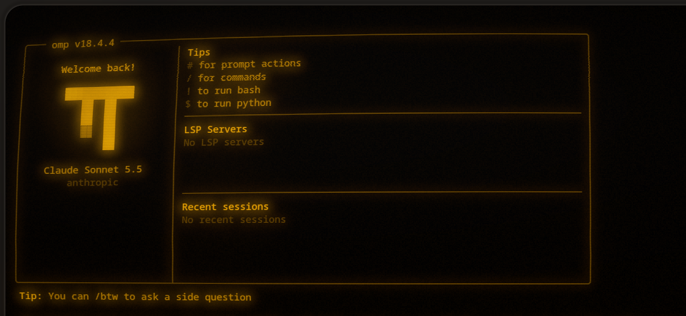
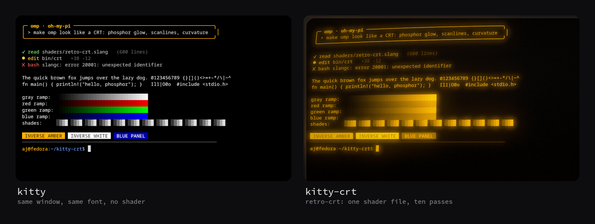
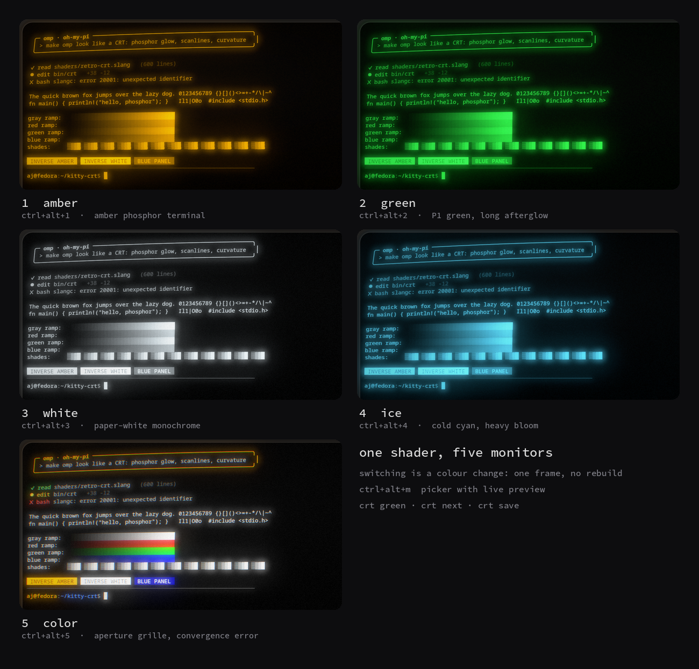
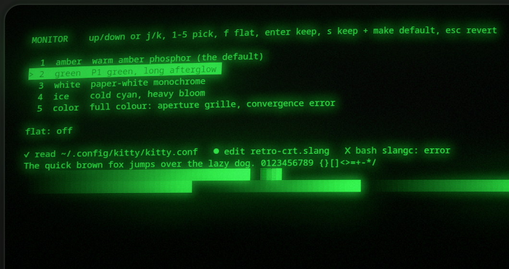
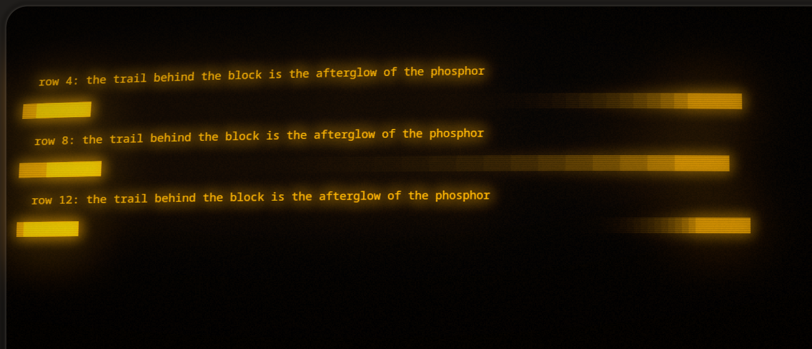
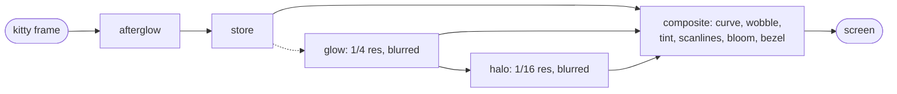

<div align="center">

# kitty-crt

**A real CRT for [kitty](https://sw.kovidgoyal.net/kitty/).**<br>
Phosphor glow, scanlines, curved glass, afterglow, and five monitors you can swap in a single frame.<br>
Made so that [omp](https://github.com/can1357/oh-my-pi) looks like it runs on a terminal from 1987.



<sub>Real pixels: <code>omp</code> in a <code>kitty-crt</code> window, captured after the shader with <code>kitten @ screenshot</code>.</sub>


</div>

---

kitty 0.49 added [custom shaders](https://sw.kovidgoyal.net/kitty/custom-shaders/), and ships a small `crt` one (a warp and
scanlines). **kitty-crt is the whole monitor** built on that interface: a ten-pass pipeline with bloom and halation, real
phosphor afterglow, a curved glass and bezel, sync wobble, convergence error, snow and flicker. Everything else about kitty stays:
its fonts, graphics protocol, kittens, layouts and speed. It is a separate entry point (`kitty-crt`), so your everyday kitty is untouched.

<div align="center">

</div>

## Quick start

```bash
git clone https://github.com/AxDSan/kitty-crt.git && cd kitty-crt
./install.sh --install-kitty     # add --install-kitty only if you do not have kitty >= 0.49 yet
kitty-crt                        # a CRT terminal
omp-crt                          # omp inside it
```

`install.sh` copies the shaders and config into `~/.config/kitty`, the commands into `~/.local/bin`, adds a launcher entry, and builds
the shader once so the first start is instant. `--dev` symlinks instead of copying (edit the repo, see it live), `--uninstall` removes
what it installed and leaves files you changed. `--install-kitty` runs kitty's [official installer](https://sw.kovidgoyal.net/kitty/binary/)
into `~/.local/kitty.app`; it never touches a kitty from your package manager.

### Keys (inside a kitty-crt window)

| keys | does |
|------|------|
| `ctrl+alt+1` … `5` | pick a monitor: amber, green, white, ice, color |
| `ctrl+alt+m` | the picker, with live preview |
| `ctrl+alt+n` | next monitor |
| `ctrl+shift+f4` | flat on or off (no curvature or bezel) |
| `ctrl+shift+f12` | live or still (see [afterglow](#afterglow-live-or-still)) |

If your desktop grabs one of these, change the `map` lines in `crt.conf`.

## Five monitors, one shader

<div align="center">

</div>

| # | monitor | what it is |
|---|---------|------------|
| 1 | **amber** | warm amber phosphor, the default. 70 ms afterglow |
| 2 | **green** | P1 green terminal, 160 ms afterglow, deeper scanlines |
| 3 | **white** | paper-white monochrome, 50 ms afterglow |
| 4 | **ice** | cold cyan, heavy bloom, a little colour fringing, rounder glass |
| 5 | **color** | full colour: aperture grille, RGB convergence error, softer beam |

Any of them can be **flat**: no curvature, bezel or wobble, so the picture is 1:1 with what kitty drew and mouse selection lines up exactly.
The 32 parameters of a monitor, and how to add your own, are in [docs/monitors.md](docs/monitors.md).

## Switching is instant

Changing a shader normally means compiling it: kitty builds a changed pipeline on its main thread and the window freezes for about six
seconds, and it caches only one pipeline, so alternating between two looks rebuilds every time. kitty-crt compiles **all five monitors
into one shader** and reads the choice from a colour kitty already hands to every shader: the `background` option, set to `#000000` plus
a code a few levels off black that nobody can see. Changing it is one frame, with nothing to rebuild.

<div align="center">

</div>

`ctrl+alt+m`, or just `crt` in any kitty-crt shell, opens a picker that previews as you move:

```text
↑ ↓ / j k    move          1 … 5    pick          f    flat on/off
enter        keep          esc      put it back   s    keep, and make it the monitor kitty-crt starts on
```

It also works from the shell:

```bash
crt green           # switch
crt next            # or prev
crt flat            # flat | curved | toggle-flat
crt save            # start on this monitor from now on
crt status
CRT_MONITOR=ice omp-crt     # a one-off start monitor
```

The `ctrl+alt+1…5` keys use kitty's own `set_colors` action (no process at all); `crt` takes about 85 ms, nearly all of it starting processes.
`crt.conf` allows programs in the window to read and set colours and **nothing else**; every other remote-control command is refused.

## Afterglow: live or still

<div align="center">

</div>

A phosphor keeps glowing after the beam has moved on. In **live** mode each pixel decays with its own time constant, in real time, so a
block sweeping across the screen leaves a trail. Live mode also animates the snow, flicker, hum bar and sync wobble. All of that needs a
frame every 16 ms, and kitty normally redraws only when something changes, so live mode adds a group that asks for one.

| | kitty CPU | GPU power (median of a 30 s run) |
|-|-----------|-----------------------------------|
| no window | | 14-20 W, depending on what the desktop is doing |
| **still** (`retro-crt`) | 0 % when idle | the same as no window (within 0.1 W in both runs). Nothing redraws: no trails, snow or flicker |
| **live** (`retro-crt crt-live`) | 7-11 % of a core | usually about 35 W: **+4 to +21 W** over four paired runs, median +16 W |

Measured on an RTX 2070 Max-Q laptop; method and caveats in [docs/performance.md](docs/performance.md).

Live is the default in `crt.conf`. On battery: `ctrl+shift+f12` (about 8 s, because a pipeline change has to be rebuilt, and `crt-switch`
does that in the background so the window never freezes), or start still with `CRT_SHADERS=retro-crt kitty-crt`.

Switching tabs plays a 320 ms channel-change burst.

## omp

`omp-crt` starts [omp](https://github.com/can1357/oh-my-pi) in a kitty-crt window and leaves you at a shell when omp exits. Arguments go to
omp (`omp-crt --continue`). The hero image is omp's own welcome screen. Anything else works the same way: `kitty-crt htop`, `kitty-crt nvim`.

## Configuration

Everything lives in `crt.conf` in your kitty config directory. It starts with `include kitty.conf`, so your normal settings apply
(fonts, colours except the background, keys), and then adds the CRT.

| variable | effect |
|----------|--------|
| `CRT_MONITOR` | monitor to start on: `amber` `green` `white` `ice` `color` |
| `CRT_SHADERS` | replaces `custom_shaders` for this start. `retro-crt` = still |
| `KITTY_CRT_BIN` | the kitty to run (default `~/.local/kitty.app/bin/kitty`) |
| `KITTY_CONFIG_DIRECTORY` | your kitty config directory (default `~/.config/kitty`) |

`crt.conf` sets `startup_session none`: if your `kitty.conf` opens a session, the CRT would open a second copy of it. Delete that line to
reuse it. It also sets `background_opacity 1` (the shader draws the whole window) and `window_padding_width 14` (the bezel and rounded
glass hide about 25 px at the edge, so keep text off them).

## How it works

Short version: ten passes (an eleventh clock pass in live mode) run after kitty draws each frame.



The long version, including the three things kitty does that shaped the design (one cached pipeline, a main-thread build, integer-truncated
viewports), is in [docs/how-it-works.md](docs/how-it-works.md). Measurements and how they were taken are in [docs/performance.md](docs/performance.md).

## Limitations

* **kitty 0.49 or newer.** Older kitty ignores custom shaders.
* **kitty's background has to stay `#000000`.** The monitor choice is carried in it. With any other background the shader falls back to
  amber and `crt` says why instead of guessing.
* **Curvature and the mouse.** kitty maps the mouse to the picture before the shader bends it, so with curvature 0.06 a click is off by up
  to about 29 px at the extreme corners (roughly one row, two or three columns at 1080p) and exact along the axes. `flat` removes it.
* **Opaque windows only.** A shader that moves pixels cannot work with `background_opacity` below 1.
* **Live ↔ still takes about 8 s**, and kitty caches one pipeline, so after a switch the next fresh start rebuilds its default.
* **One machine.** Developed and measured on Fedora 43, KDE Plasma 6 (Wayland), NVIDIA RTX 2070 Max-Q, kitty 0.49.1. It uses only kitty's
  public shader interface (OpenGL, cross-platform), but I have not run it anywhere else.

## Development

```bash
python3 -m unittest discover -s tests     # 22 tests: the shader, the CLI and the key bindings agree
shellcheck -x install.sh tools/shots.sh bin/*
KITTY_CONFIG_DIRECTORY=$PWD CRT_MODE=check \
    ~/.local/kitty.app/bin/kitty +runpy "exec(open('tools/shader-build.py').read(), {})"   # compile like kitty does
tools/shots.sh all                        # regenerate every image in assets/ (opens real windows for a few seconds each)
```

The monitor choice is a contract between three files that cannot import each other: the shader decodes it, `bin/crt` and the `ctrl+alt+N`
bindings encode it. `tests/test_contract.py` pins them together, and `tests/test_cli.py` runs `crt` as a process against a fake `kitten`,
including the private-channel path the key bindings use. CI runs those, `shellcheck`, compiles both pipelines with kitty's own `slangc`
(`-warnings-as-errors all`), and round-trips the installer.

```text
shaders/   retro-crt.slang, retro-crt.pipeline, crt-live.pipeline, retro-crt-pass.slang
bin/       kitty-crt, omp-crt, crt (CLI + picker), crt-switch (live/still)
config/    crt.conf.in, crt-monitor.conf        share/  launcher entry
tools/     shader-build.py, shots.sh, compose.py, patterns/
docs/      how-it-works.md, monitors.md, performance.md
tests/     test_contract.py, test_cli.py
```

## Credits

* [cool-retro-term](https://github.com/Swordfish90/cool-retro-term) showed how good a terminal can look through a CRT. This is the same idea
  as a shader for kitty; no code is shared.
* [kitty](https://github.com/kovidgoyal/kitty) by Kovid Goyal for the custom shader system, and [Slang](https://shader-slang.org/) for the
  shading language. The barrel distortion is the standard form used by many CRT shaders.
* Written with [omp](https://github.com/can1357/oh-my-pi).

## License

[MIT](LICENSE) © 2026 Abdias J
