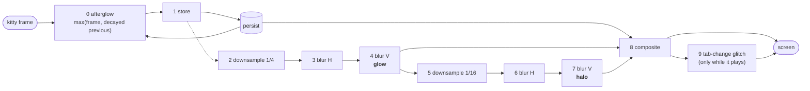

# How it works

kitty 0.49 added [custom shaders](https://sw.kovidgoyal.net/kitty/custom-shaders/): after kitty has drawn a
frame, a *pipeline* of full-screen Slang passes can rework it before it reaches the screen. The `crt` shader
that ships with kitty is a warp plus scanlines. kitty-crt is the whole monitor: ten passes (eleven in live mode), five
monitors, afterglow, bloom, and a way to switch monitors without waiting for a shader to build.

## The passes

`shaders/retro-crt.slang` is one file. `shaders/retro-crt.pipeline` runs it once per *group*, each time with a
different `var int STAGE`, so every group compiles to its own small program.



| # | pass | writes | what it does |
|---|------|--------|--------------|
| 0 | afterglow | `a` | `max(new frame, previous frame × exp(-dt/τ))`. `dt` is real time since the last frame, so the trail fades at the same speed at 30 or 144 fps. |
| 1 | store | `persist` | copies it into the one texture kitty keeps between frames |
| 2–4 | glow | `b`, `a`, `b` | ¼-resolution box downsample, then a separable 13-tap gaussian |
| 5–7 | halo | `a`, `b`, `a` | the glow again at 1/16 resolution: the wide haze around bright text |
| 8 | composite | screen | everything else, below |
| 9 | tab glitch | screen | a 320 ms channel-change burst on `tab-change` (rows slip, colours split, snow) |

**Composite** works in this order: barrel curvature (equal bowing in pixels on both axes) and a rounded glass
opening → per-line horizontal sync wobble and a rolling tear band → beam softness and RGB convergence error →
tint to the phosphor (monochrome monitors keep saturated colours readable through `mono_value`) → scanlines
whose gaps are filled by bright pixels, plus an optional aperture grille → glow and halo added → soft highlight
roll-off → display-space grading (flicker, hum bar, snow, ambient light, vignette, a reflection on the glass) →
plastic bezel that catches some of the screen's light.

### One texture atlas, two textures

kitty gives a pipeline three named offscreen textures: `a`, `b` and `persist`. The bloom chain needs six
intermediate images, so it packs them as rectangles (`R_B0`, `R_A0`, `R_B1`, `R_A1`, `R_B2`, `R_A2` in the shader)
into `a` and `b` by giving each group a `viewport_pos` / `viewport_size`. Two things bit during development and are
worth knowing:

* A group cannot read the texture it writes, so the chain alternates `b → a → b → a …`.
* kitty truncates both corners of a group's viewport to integer pixels. Sampling with the nominal fraction bleeds a
  fraction of a texel from **outside** the rectangle, where the texture holds stale data, and that showed up as
  streaks along the top edge. `region_pixels()` reproduces kitty's truncation and `sample_region()` clamps to
  pixel centres inside it.

The pipeline file and the shader must agree on the rectangles; both say so in a comment.

## Monitors are chosen at run time

The obvious way to offer several monitors is a pipeline file per monitor that overrides `static const` values with
`var` lines. That works, but every `var` is baked in when the shader is *compiled*:

* a switch means rebuilding all groups (about 5–8 s here, sequential `slangc` processes);
* kitty builds it on its **main thread**, and the window froze for about 6 s while it did;
* kitty caches only **one** pipeline, so alternating between two monitors rebuilds every time.

So kitty-crt compiles **every monitor into the one shader** and reads the choice from something kitty lets you
change instantly and hands to shaders every frame. `KittyCustomShaderData.background` is kitty's `background` colour
option. `set-colors --configured` changes it in one frame, and it is not otherwise visible when it is a few levels
off black:

```
background = #RR00BB      R = 0 or 1 (bit 0 = flat)      B = 0..4 (amber green white ice color)
```

* `#000000` is amber, curved: the default, which is why nothing has to be configured.
* The shader rounds the colour back to 8-bit sRGB, requires every channel ≤ 15, and otherwise **falls back to amber**
  rather than guessing. A real theme background (say `#1e1e2e`) therefore never selects a monitor by accident.
* It also subtracts the code from the picture, so the near-black background is exactly black on every monitor.
* `monitor_look()` in the shader is a plain `switch` returning a `Look` struct (32 parameters). Switching costs
  nothing because it is just a different branch of the same compiled program.

The encoder side lives in three places that cannot import each other: `bin/crt`, the `ctrl+alt+N` bindings in
`config/crt.conf.in`, and the shader. `tests/test_contract.py` pins them together.

### Who can change it

* **Keys**: `ctrl+alt+1..5` run kitty's own `set_colors` action. No process, no remote control, one frame.
* **`crt`** (typed in a kitty-crt shell, or from the picker): `kitten @ set-colors`, over the terminal's TTY.
  `crt.conf` sets `allow_remote_control password` with `remote_control_password "" get-colors set-colors`: programs in
  the window may read and set colours and nothing else. Every other remote-control command is refused.
* **Keys that need to read state first** (`ctrl+alt+n`, `ctrl+shift+f4`) run `crt` through
  `launch --type=background --allow-remote-control`, which gives that one process a private channel.

## Live or still

Afterglow needs a frame every ~16 ms while a trail fades, and kitty only redraws when something changes. The
pipeline is therefore *still* by default (every group has `animation_step 0`: an idle terminal redraws nothing).
`shaders/crt-live.pipeline` layers a second pipeline on top of it (`custom_shaders retro-crt crt-live`):

* `var int LIVE = 1` compiles the afterglow in (without it the persistence code is dead: with no clock a trail would
  freeze on screen);
* one extra group, `retro-crt-pass` (returns its input unchanged) with `animation_step 16`, which is what makes kitty
  redraw at 60 fps. That, and nothing else, is the cost of live mode; see [performance](performance.md).

Toggling between the two changes the pipeline, so it is the one switch that cannot be instant.
`bin/crt-switch` (ctrl+shift+f12) builds the new pipeline in a separate process first (filling kitty's cache) and only
then applies it with `kitten @ load-config -o custom_shaders=…`. The window never freezes, and the switch itself takes
about 0.3 s once the build is done.

## Things kitty does that shaped the code

* Every shader is compiled with `slangc -warnings-as-errors all`. `tools/shader-build.py` reproduces that outside a
  window, and CI runs it.
* `var` substitution is a regex over single-line `static const <type> NAME = …;` declarations, and the type in the
  `var` line has to match the declaration's type, or nothing is replaced (silently).
* Non-final groups return colour premultiplied by alpha; all offscreen textures are 16 bit per channel, so trails and
  bloom do not band.
* `t.pos` is the position on the *whole* image even inside a group with a sub-viewport, which is what lets a group
  write a downscaled copy of the frame into a corner of a texture.
* `-o custom_shaders=…` and `load-config` both go through the same cache; `~/.cache/kitty/shaders` holds exactly one
  pipeline, so after switching live/still the next fresh start of kitty-crt rebuilds its default (`install.sh`
  pre-builds it once).
